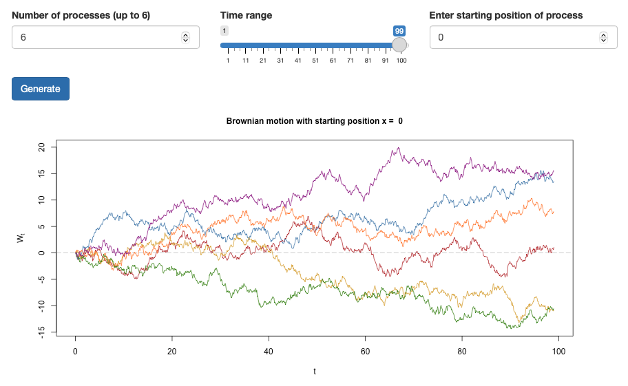
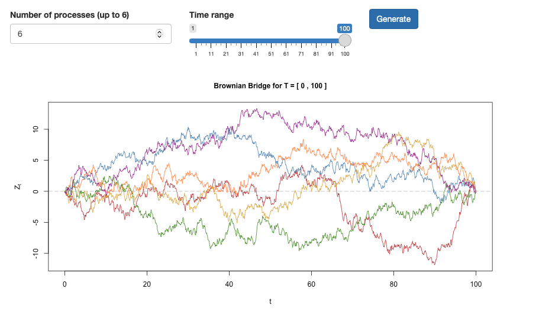
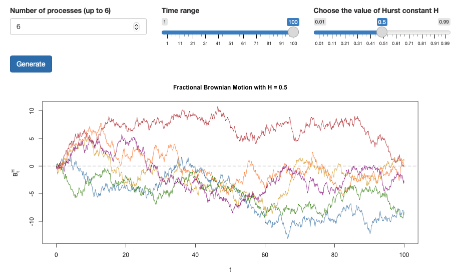

# Gaussian process simulation using Cholesky

This R notebook covers discrete-time Gaussian processes and the Cholesky decomposition of the covariance matrix. It introduces some well-known Gaussian processes and includes interactive R-shiny apps to simulate them based on the Cholesky method. 

### Brownian motion



### Brownian bridge



### Fractional Brownian motion



## Usage

To clone this repository :
```bash
git clone https://github.com/celinenguyentu/Gaussian_process_via_Cholesky.git
``` 

To render the R notebook, run this command in your R console :
```r
rmarkdown::run("Gaussian_Process_via_Cholesky.Rmd")
```